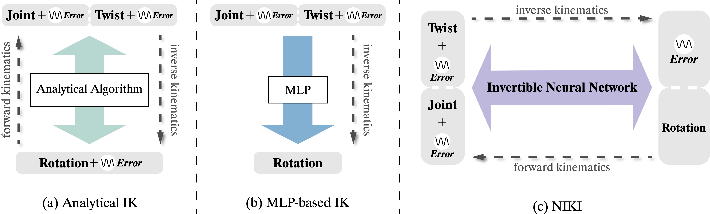

# NIKI: Neural Inverse Kinematics with Invertible Neural Networks for 3D HPS


<div align="center">
 

<br>

<a href="https://arxiv.org/abs/2305.08590">
    
</a>
<a href="https://youtu.be/2tPAYLtat4I">
    
</a>
</div>


This repo contains the code of our paper:

**NIKI: Neural Inverse Kinematics with Invertible Neural Networks for 3D Human Pose and Shape Estimation**

[Jiefeng Li](http://jeffli.site/HybrIK/)\*, [Siyuan Bian](https://github.com/biansy000)\*, [Qi Liu](), [Jiasheng Tang](), [Fan Wang](https://scholar.google.com/citations?user=WCRGTHsAAAAJ&hl=en), [Cewu Lu](http://mvig.org/)


In CVPR 2023


<div align="center">
    <br>
    Different Inverse Kinematics Framework
</div>
<br>
<div align="center">
    <br>
</div>


## Installation instructions

``` bash
# 1. Create a conda virtual environment.
conda create -n niki python=3.8 -y
conda activate niki

# 2. Install PyTorch
conda install pytorch==1.13.0 torchvision==0.14.0 torchaudio==0.13.0 pytorch-cuda=11.6 -c pytorch -c nvidia


# 3. Install PyTorch3D (Optional, only for visualization)
conda install -c fvcore -c iopath -c conda-forge fvcore iopath
conda install -c bottler nvidiacub
pip install git+ssh://git@github.com/facebookresearch/pytorch3d.git

pip install -r requirements.txt

# 4. Pull our code
git clone git@github.com:Jeff-sjtu/NIKI.git
cd NIKI
```


## Models
* Download our pretrained model from [[Google Drive](https://drive.google.com/file/d/1Gql6xLj1UEkTILn20VkECnm6qE_ntG8O/view?usp=sharing) | [Baidu](https://pan.baidu.com/s/1npIDjJQyTOKax1lBtG1D2A?pwd=z4iv) (code: `z4iv`)].


# Fetch data
* Download parsed annotations from [[Google Drive](https://drive.google.com/drive/folders/1Ej-Sl8OE67tRlxzQBLEBVklHAObHcy-h?usp=sharing)].


## Train
``` bash
python scripts/train.py --cfg configs/NIKI-ts.yaml --exp-id niki-ts
```

## Evaluation
``` bash
python scripts/validate.py --cfg configs/NIKI-ts.yaml --ckpt niki-ts.pth
```

## Demo
Download pretrained HybrIK and Single-stage NIKI models from [onedrive link](https://sjtueducn-my.sharepoint.com/:f:/g/personal/biansiyuan_sjtu_edu_cn/EtGnxMf0bkpPhB8OPecnzhoBbKzgXrhyVguV_B5g4r8_rQ?e=UGDdRJ), and put them in ``exp/`` folder.
``` bash
python scripts/demo.py --video-name {VIDEO-PATH} -out-dir {OUTPUT-DIR}
```


## Citing
If our code helps your research, please consider citing the following paper:

    @inproceedings{li2023niki,
        title     = {{NIKI}: Neural Inverse Kinematics with Invertible Neural Networks for 3D Human Pose and Shape Estimation},
        author    = {Li, Jiefeng and Bian, Siyuan and Liu, Qi and Tang, Jiasheng and Wang, Fan and Lu, Cewu},
        booktitle = {Proceedings of the IEEE/CVF Conference on Computer Vision and Pattern Recognition (CVPR)},
        month     = {June},
        year      = {2023},
    }